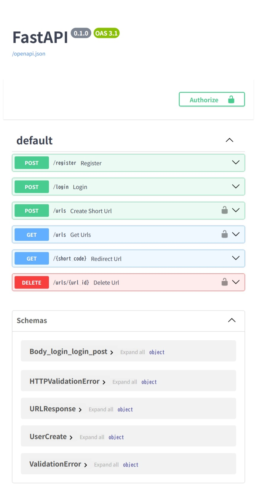

# URL Shortener API

---

## 1. 概要

FastAPIを使用して作成したURL短縮APIです。
JWT認証を利用し、ユーザーごとに短縮URLを管理できるようにしています。
また、ページネーションや認可処理を実装し、実務を意識した設計にしています。

---

## 2. 機能

* ユーザー登録
* ログイン（JWT認証）
* URL短縮
* 短縮URLから元URLへリダイレクト
* URL一覧取得（ページネーション対応）
* URL削除（認可あり）
* クリック数カウント

---

## 3. 技術スタック

* FastAPI
* SQLAlchemy
* SQLite
* python-jose（JWT認証）
* passlib / bcrypt（パスワードハッシュ化）
* Docker / docker-compose

---

## 4. ディレクトリ構成

```
url-shortener-api/
├── app/
│   ├── main.py
│   ├── db.py
│   ├── models.py
│   ├── schemas.py
│   ├── auth.py
│   ├── crud.py
│   └── routers/
│       ├── auth.py
│       └── url.py
├── data/
├── .env
├── Dockerfile
├── docker-compose.yml
├── requirements.txt
└── README.md
```

---

## 5. API例 / ログイン

### リクエスト

```
POST /login
Content-Type: application/x-www-form-urlencoded
```

```
username=test@test.com
password=123456
```

### レスポンス

```
{
  "access_token": "xxxxx",
  "token_type": "bearer"
}
```

---

## 6. API使用例 / URL一覧取得

### リクエスト

```
GET /urls?limit=5&offset=0
Authorization: Bearer xxxxx
```

### レスポンス

```
[
  {
    "id": 1,
    "original_url": "https://example.com",
    "short_code": "abc123",
    "click_count": 3
  }
]
```

---

## 7. 実行方法

### 環境変数（.env）

```
DATABASE_URL=sqlite:///./data/app.db
SECRET_KEY=your_secret_key
ALGORITHM=HS256
```

---

### Dockerで起動

```
docker-compose up --build
```

---

### APIドキュメント

以下にアクセスするとSwagger UIが表示されます。

```
http://localhost:8000/docs
```

---

## 8. APIドキュメント画面



---

## 9. 工夫した点

* JWT認証を用いてユーザーごとのデータ管理を実装
* URL削除時に認可処理を追加し、他ユーザーのデータ操作を防止
* ページネーション（limit / offset）を導入し、大量データに対応
* bcryptによるパスワードハッシュ化でセキュリティを向上
* Dockerを用いて環境構築を簡略化

---

## 10. 今後の改善

* PostgreSQLへの移行
* URL更新機能（PUT/PATCH）の追加
* 有効期限付きURLの実装
* テストコードの追加（pytest）
* フロントエンドとの連携

```
```